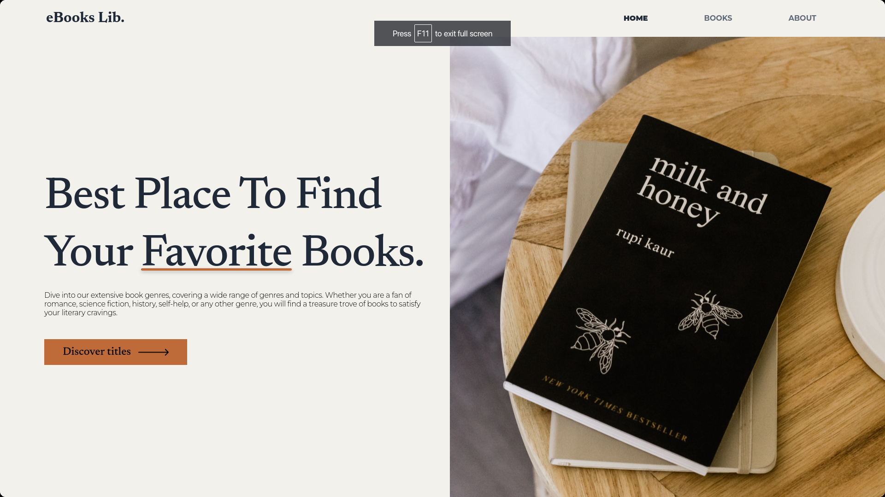
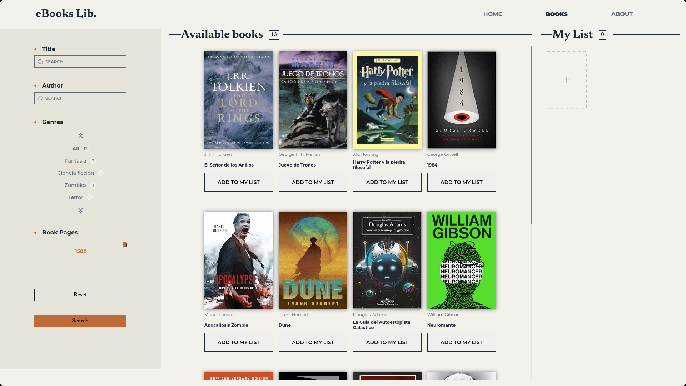
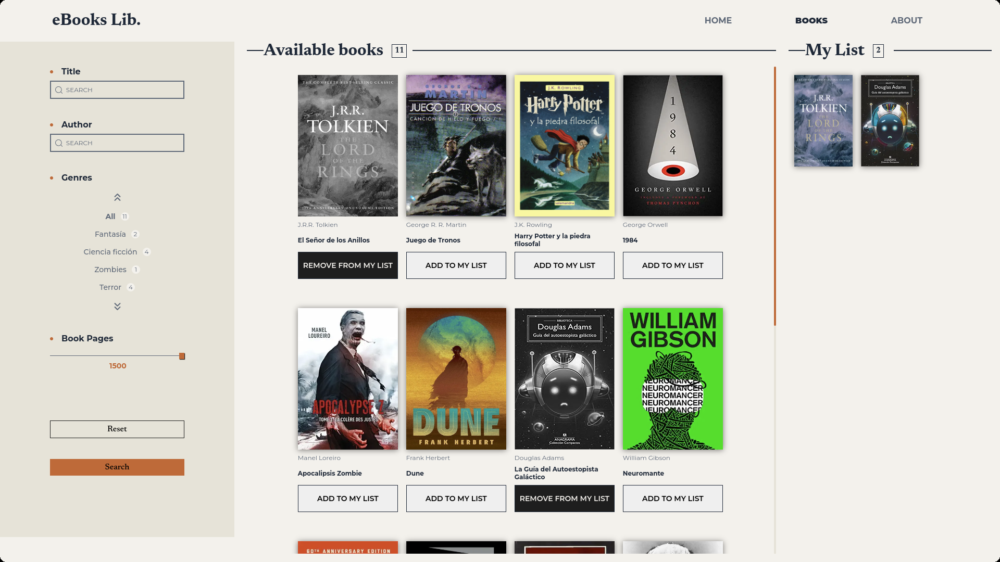
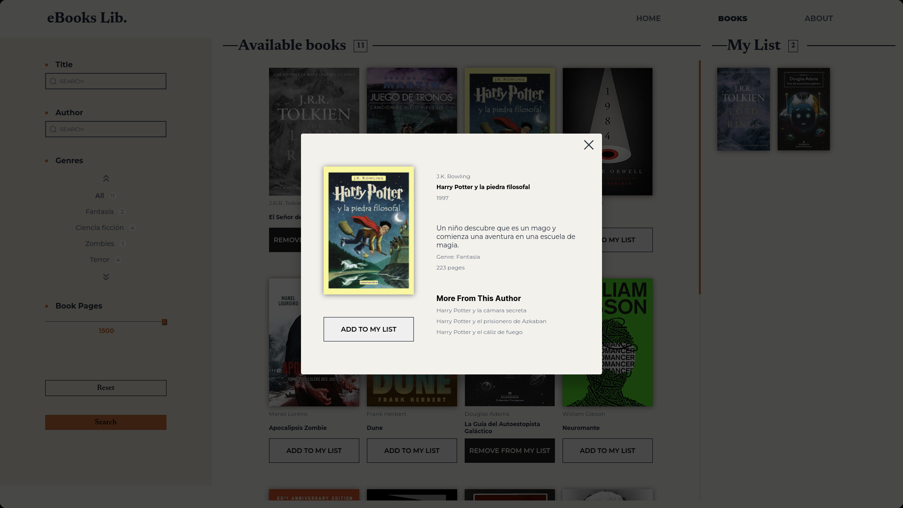
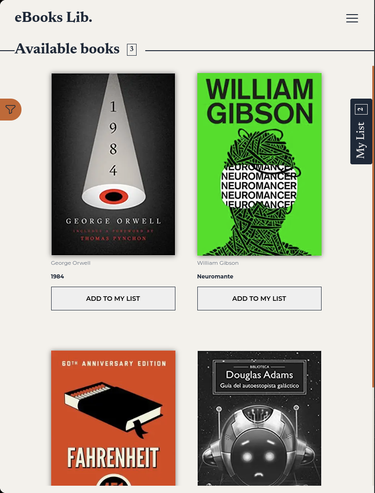

# eBooks Lib. Documentation

# Table of Contents

1. [Introduction](#introduction)
2. [Project Structure](#project-structure)
3. [Installation](#installation)
4. [Main Functionalities](#main-functionalities)
5. [CSS Styles](#css-styles)
6. [Dependencies](#dependencies)
7. [Future Features](#future-features)

## Introduction:

This project is part of the initiative by Midudev (Miguel Ángel Durán) to provide technical challenges for junior developers. In this instance, the project involves creating an application that simulates a reading library with the main target:

1. Display Available Books: The application must present a list of available books for users to review.

2. Create Reading List: Users should be able to create a personalized reading list from the available books. The UI should clearly indicate which books are in the reading list and which ones are not. It should also allow moving a book from the reading list back to the available list.

## Web Screenshots

Home Page Desktop

Books Page Desktop

Reading List With Items

Book Modal Detail

Book Page Mobile

Filter Modal Mobile

Reading List Modal Detail

## Project Structure:

Apart from the common files and folders found in any frontend project, there is a "json" folder from where static data is served. Although the application is set up with endpoints provided by Next.js, there is a front-end service layer to execute fetching to external links. The entire project is located inside the "src" folder, and it includes the following directories:

-   "api": Contains the front-end service layer.
-   "app": Acts as the entry point to the application and includes the application's pages and Next.js endpoints.
-   "layouts": Contains all the application's layouts provided.
-   "components": Holds the reusable components used throughout the application.
-   "models": Contains common TypeScript interfaces used throughout the project.
-   "redux": Implements Redux in the application, including slices, store, and provider.
-   "styles": Contains the application's styles using SASS, with separate modules for common and default style values.
-   "utils": Holds auxiliary code functionalities.
-   "test": Contains the tests conducted for the application.

## Installation:

To set up the project, follow these steps:

1. Clone the repository from GitHub or download the source code.

2. Ensure you have Node.js and npm installed on your machine.

3. Open a terminal or command prompt and navigate to the project's directory.

4. Run the following command to install the necessary dependencies: npm install

5. Once the installation is complete, you can start the project in the development environment by running: npm run dev

6. If you wish to deploy the production environment, first build the project with: npm run build

7. Then, start the project in the production environment with: npm start

You should now have the project up and running and accessible through the URL provided by Next.js in the development environment or the hosting service where you deployed the production environment.

## Main Functionalities:

The "Books" tab is the core of the test, and it encompasses the main functionalities of the application, including:

1. Displaying Available Books.
2. Creating a Reading List.
3. Filtering Books by Genre and Other Criteria.
4. Synchronizing State.
5. Persisting Reading List Data.
6. Synchronization between Tabs.
7. Providing a Coherent Project Structure for Data Provision and Interaction.

Additionally, the application adheres to semantic HTML, with main tags in SSR (Server-Side Rendering) to improve SEO and indexing. The BEM methodology is used for improved readability and application of styles. The page is also fully responsive, adapting to any screen size.

## CSS Styles:

CSS styles have been implemented using SASS (Syntactically Awesome Style Sheets) exclusively. Given that the styles were based on a design in Figma, all decorative images were introduced using SCSS. The use of Figma design enabled the creation of a set of initial classes and variables for consistent styling and easy access. This approach also allows for updating the application's general styles from these files. CSS rules have been nested, yet without compromising readability. They are declared in the order that HTML is constructed, following the BEM methodology for easy comprehension.

## Dependencies:

The project relies on the following dependencies:

-   reduxjs/toolkit
-   eslint
-   next
-   react-hook-form
-   react-redux
-   redux-state-sync
-   sass
-   typescript

## Future Features:

In addition to the current functionality, the application has potential for further enhancements and features. Some of the planned future features are:

1. **Drag and Drop:**
   Implementing a drag and drop functionality will allow users to easily rearrange the order of books in their reading list. This will provide a more interactive and user-friendly way to organize their reading preferences.

2. **Priorities List Order:**
   Adding the ability for users to assign priority levels to books in their reading list. This feature will enable users to indicate which books they want to read first, second, etc. based on their personal preferences.

3. **Dynamic Home Image Load:**
   Instead of relying on static images, introducing a dynamic home image load will allow the application to fetch and display relevant book cover images from external sources or APIs. This will enhance the visual appeal of the application and provide real-time updates to book covers.

These proposed features aim to improve the user experience and make the application more versatile and feature-rich. As development progresses, these enhancements can be prioritized and implemented to further enhance the functionality and usability of the reading library application.
